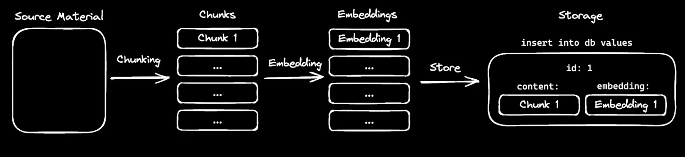
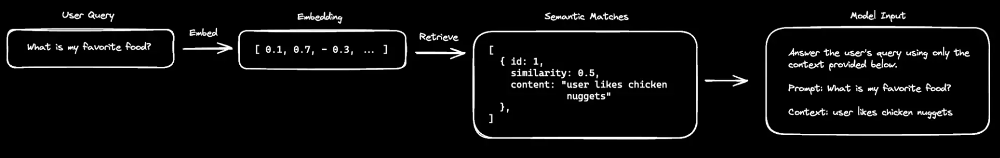

---
# VERCEL AI SDK RAG Chatbot

In this project, we will build a chatbot that responds only with information it has within its knowledge base. The chatbot will be able to both store and retrieve information. This project has a wide range of use cases, from customer support to building your own second brain!
---

## What is RAG?

RAG stands for **Retrieval Augmented Generation**. In simple terms, RAG enhances a **Large Language Model (LLM)** by providing it with specific, relevant information to improve its response accuracy.

---

## Why is RAG Important?

While LLMs are powerful, their reasoning is limited to the data they were trained on. This limitation becomes evident when asking an LLM for information beyond its training data. RAG addresses this issue by fetching relevant information and passing it to the model as context.

For example, consider this basic interaction:

**Input:**

> What is my favorite food?

**Model Response:**

> I don't have access to personal information about individuals, including their favorite foods.

The model doesn’t know the answer because it lacks context. Now, imagine the following:

**Input:**

> Respond to the user's prompt using only the provided context.  
> User prompt: _What is my favorite food?_  
> Context: _User loves chicken nuggets._

**Model Response:**

> Your favorite food is chicken nuggets!

By augmenting the model's generation with the provided context, it can respond accurately. But how does the model retrieve this relevant information? The answer lies in a concept called **embedding**.

---

## Embedding

Embeddings are a way to represent words, phrases, or images as vectors in a high-dimensional space. In this space, similar concepts are located close to each other. The distance between vectors indicates their semantic similarity.

For instance, embeddings for "cat" and "dog" would be closer together than embeddings for "cat" and "car." The process of measuring similarity between two vectors is called **cosine similarity**, where a value of 1 indicates high similarity and -1 indicates high opposition.

When dealing with longer content (e.g., paragraphs or documents), embedding the entire input can reduce quality. To address this, we use a technique called **chunking**.

---

## Chunking

Chunking involves breaking down source material into smaller, more manageable pieces. Various chunking approaches exist, and the best method often depends on the use case. A simple and common method is to separate content by sentences.

Once the source material is chunked, each chunk is embedded, and the embeddings are stored in a database along with the chunks. Databases that support vector storage (e.g., Postgres with the `pgvector` plugin) are ideal for this purpose.

---

## All Together Now

By combining these concepts, RAG enables a model to respond accurately to queries outside its training data. Here's how it works:

1. The user’s query is embedded.
2. The system retrieves the source material chunks with the highest semantic similarity to the query.
3. The relevant chunks are passed to the model along with the query as context.

For example, when asking the model about your favorite food, the prompt preparation process looks like this:

By providing the appropriate context and refining the model’s objectives, we can maximize its reasoning capabilities.

---

## Tools

A tool is a function that can be called by the model to perform a specific task. We can think of a tool like a program we give to the model that it can run as and when it deems necessary.

---

## Tech Stack

This project will use the following technologies:

- [Next.js](https://nextjs.org) – Framework for building the chatbot's frontend and backend.
- [Vercel AI SDK](https://sdk.vercel.ai/docs) – Tools for integrating AI capabilities.
- [OpenAI](https://openai.com) – LLM provider.
- [Drizzle ORM](https://orm.drizzle.team) – Type-safe ORM for database management.
- [Postgres](https://www.postgresql.org/) – Database to store embeddings and chunks.
- [pgvector](https://github.com/pgvector/pgvector) – Plugin for storing vector embeddings in Postgres.
- [shadcn-ui](https://ui.shadcn.com) – UI component library.
- [TailwindCSS](https://tailwindcss.com) – Utility-first CSS framework for styling.

---
